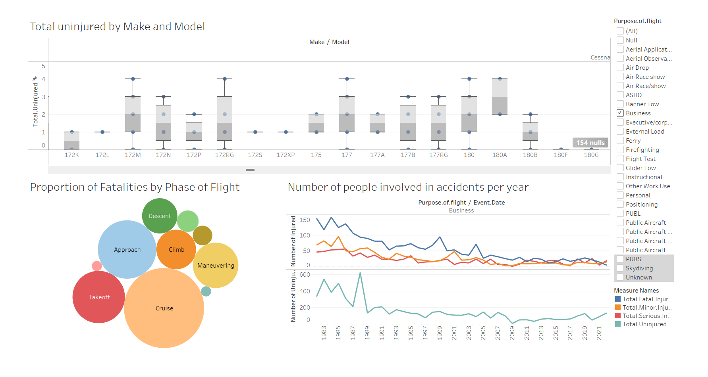

# Project-Overview
This project aims to assist our company in expanding into the aviation industry by identifying the lowest risk aircraft for commercial and private enterprises. By leveraging data from the National Transportation Safety Board (NTSB) on aviation accidents from 1962 to 2023, we will perform data cleaning, imputation, analysis, and visualization to generate actionable insights. The end goal is to provide three concrete business recommendations for the head of the new aviation division to inform aircraft purchasing decisions.

# Business-Problem
Our company is diversifying its portfolio by entering the aviation industry. However, the potential risks associated with different aircraft models are unknown. This project will determine the lowest risk aircraft to help mitigate potential operational risks and ensure a safe investment.

Photo by <a href="https://unsplash.com/@jakobnoahrosen?utm_content=creditCopyText&utm_medium=referral&utm_source=unsplash">Jakob Rosen</a> on <a href="https://unsplash.com/photos/white-and-blue-passenger-plane-kZfdHrUoB3U?utm_content=creditCopyText&utm_medium=referral&utm_source=unsplash">Unsplash</a>
  

# Data-Understanding
The dataset used for this project comes from the NTSB and includes detailed information on civil aviation accidents and selected incidents within the United States and international waters. The dataset spans from 1962 to 2023 and includes various attributes related to each accident or incident.

You can get the data from [Kaggle](https://www.kaggle.com/datasets/khsamaha/aviation-accident-database-synopses)

# Tableau

[Link-to-Tableau-Public](https://public.tableau.com/app/profile/erickson.mbuvi/viz/AircraftRiskAnalysis_17183560360140/Aircraftanalysisdashboard)

# Recommendation

- Based on the analysis we came down to two Aircrafts that are the lowest risk

    |   | Make     | Model     |
    | - | -------- |---------- |
    | 1.| Boeing   | B737-2H4  |
    | 2.| Rockwell | NA-265-80 |

- The company should also enhance Safety Protocols for Critical Flight Phases such as:
 - strict pre-flight checklists and sophisticated simulation training for takeoff 
 - precision landing technologies should be adopted 
 - improving in-flight monitoring and communication systems  during cruising 

